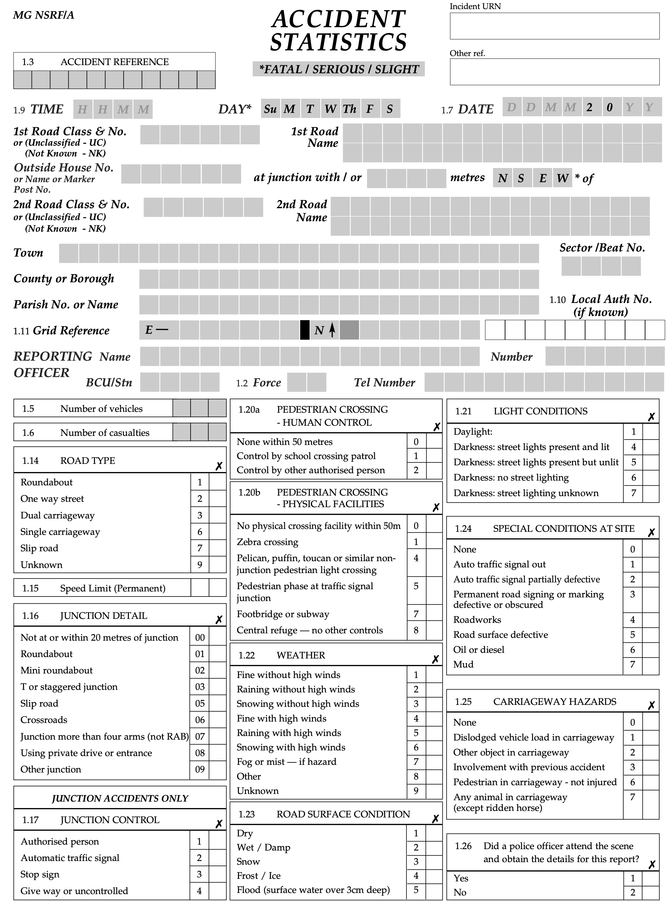
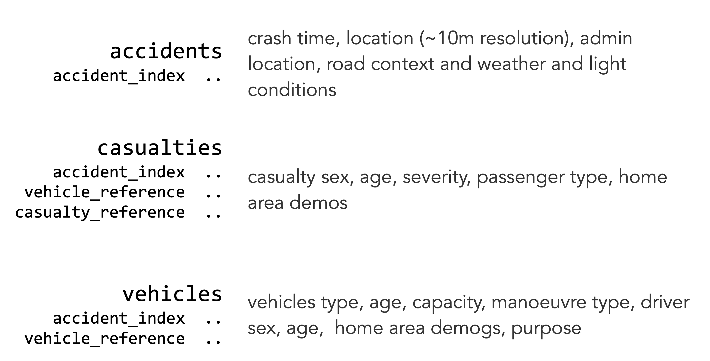
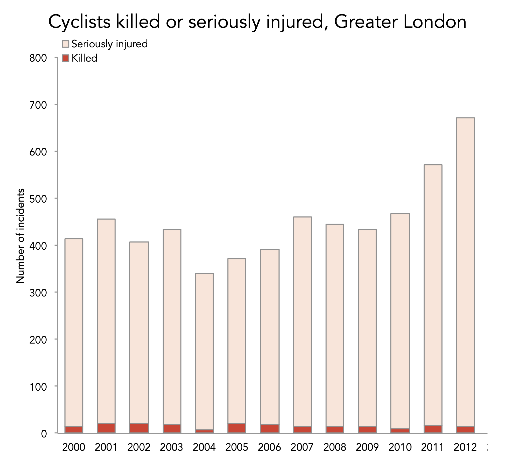
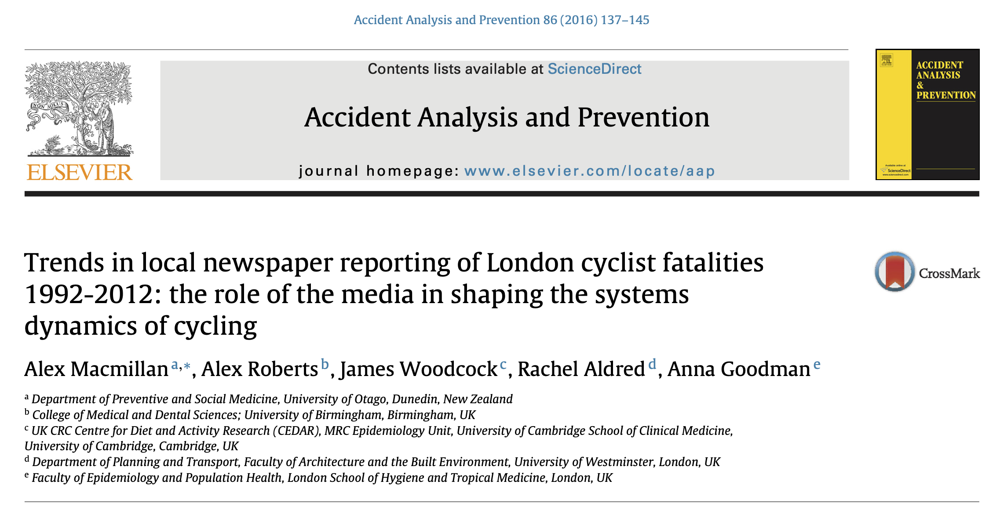
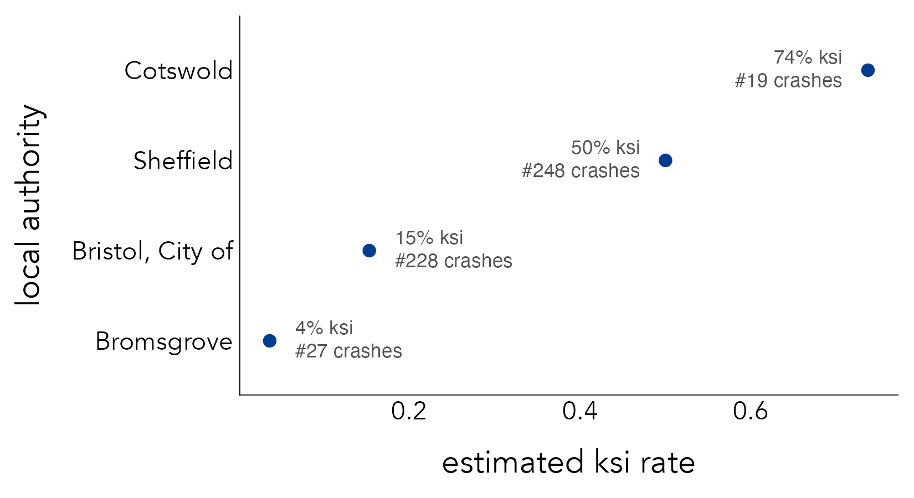
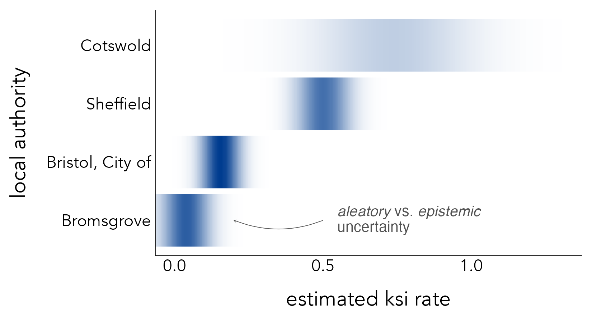
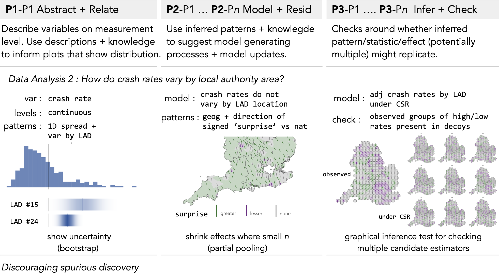
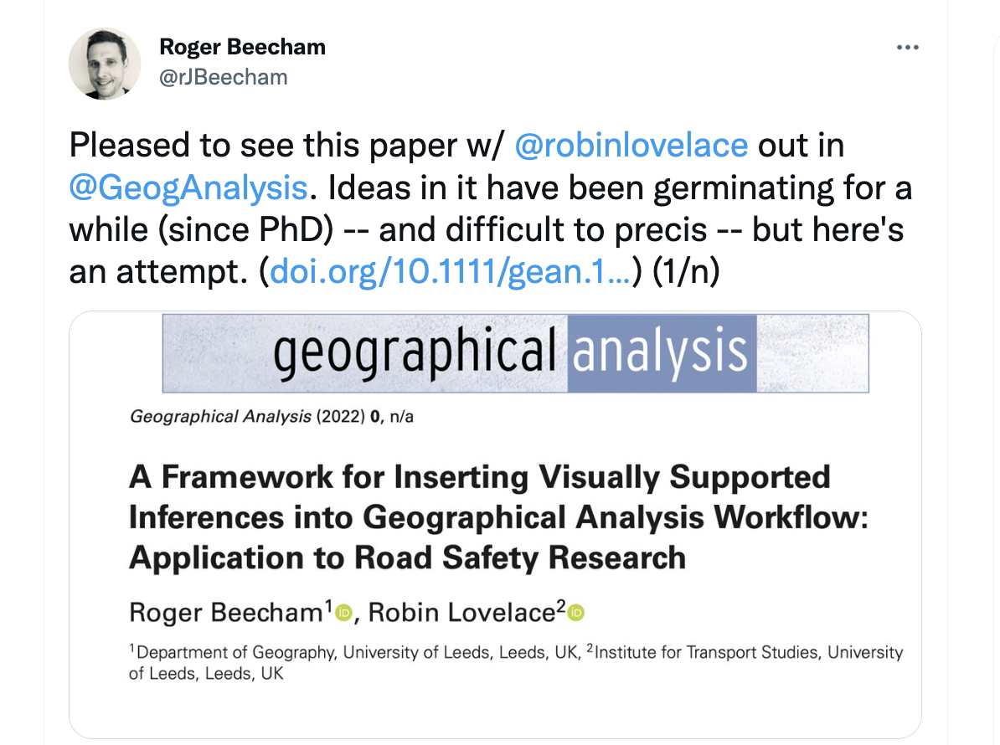

## Workshop Overview & Agenda {background-color="#f8f9fa"}

**Session Duration:** 60 Minutes

- **00:00 – 00:15** | **Introduction to STATS19 & `{stats19}`**
- **00:15 – 00:30** | **Research & Methodological Challenges**
- **00:30 – 01:00** | **Interactive Breakout Groups**
  - **Group 1 (Robin)**: Hands-on code & vignette walkthrough (Laptops out!).
  - **Group 2 (Roger)**: Research design & analysis ideas discussion.
  - **Group 3**: Informal break / walk & networking.

---

# Part 1: The STATS19 Dataset & Package {background-color="#003366"}

---

<!-- ## What is STATS19 Data? -->

{.absolute top=10 left=20 width="40%"} 
{.absolute top=30 left=600 width="30%"} 

---


{.absolute top=110 left=30 width="75%"} 


::: {.notes}

wide set of possibilities for analysis 

:::

---

<!-- ## `{stats19}` R Package

### Historical Challenges:
- Messy annual zip files with changing column names and codings.
- Manual downloading, unzipping, cleaning, and linking across years.

### `{stats19}` Solutions:
- **One-line functions** to download, clean, and format data.
- Standardized schemas across historical data releases.
- Native `sf` integration for spatial analysis.

```r
library(stats19)
library(sf)
library(dplyr)
```

---

## Rapid Data Retrieval

```r
# Download crash data for a specific year
crashes_2022 <- get_stats19(year = 2022, type = "crash")

# Format into spatial sf object
crashes_sf <- format_sf(crashes_2022)

# Download casualties and vehicles linked to crashes
casualties_2022 <- get_stats19(year = 2022, type = "casualty")
vehicles_2022   <- get_stats19(year = 2022, type = "vehicle")
``` -->


{.absolute top=100 left=30 width="70%"} 


::: {.notes}

previosly messy annual download 

:::

---


{.absolute top=70 left=30 width="50%"} 

::: {.notes}

now simple function

:::

---

# Part 2: Research & Methodological Challenges {background-color="#003366"}

---

[**denominators**]{.absolute top=300 left=100 style="font-size: 2.5em; color: #3d3d3d;"}

---

{.absolute top=50 left=30 width="60%"} 

::: {.notes}

denominator neglect

:::
---


{.absolute top=50 left=30 width="60%"} 

{.absolute top=20 left=500 width="40%" style="transform: rotate(15deg);"}

::: {.notes}

denominator neglect

:::
---

{.absolute top=30 left=30 width="75%"} 

---

{.absolute top=30 left=30 width="75%"} 

[**denominator neglect!**]{.absolute top=20 left=600 style="transform: rotate(15deg); font-size: 1.5em; color: #3d3d3d;"}


---


[**low frequency (idiosyncraric) events**]{.absolute top=250 left=100 style="font-size: 1.5em; color: #3d3d3d;"}


::: {.notes}

low frequency events : what is an appropriate scale of analysis of aggregation
--> statistical approaches that use aleatory uncertainty (randomness)
--> frequency framing --> fareham vs Oxgord

:::
---

{.absolute top=70 left=30 width="75%"} 

---


{.absolute top=70 left=30 width="75%"} 

---

{.absolute top=70 left=30 width="75%"} 

---

{.absolute top=70 left=30 width="75%"} 

---

to add frequency framing


[**risk of 'wonky' inferences**]{.absolute top=250 left=100 style="font-size: 1.5em; color: #3d3d3d;"}

::: {.notes}

because crashes occur as a result of interacting conditioning context, once start to decompose any statistical summaries it is hard to separate out relative effect of factors on that context. 

:::

---

{.absolute top=80 left=450 width="48%"}
{.absolute top=350 left=450 width="44%"}


{.absolute top=0 left=0 width="30%"}

---


<!-- ## Part 2: Content TBC (15–30 Mins)

This section is currently To Be Confirmed (TBC). -->

<!--
## Challenge 1: Denominator Neglect

- **The Problem:** Counting crashes or casualties in isolation without accounting for exposure (traffic volume, pedestrian flow, vehicle-km).
- **The Risk:** Identifying a high-traffic junction as "dangerous" purely because high volume generates more total events, while individual risk might actually be low.

::: {.callout-important}
### Motivating Example
A corridor with 10 pedestrian casualties and 100,000 daily pedestrians is safer per trip than a corridor with 5 casualties and 1,000 daily pedestrians. Always seek denominator/exposure data!
:::

---

## Challenge 2: Aggregation Scale & Low-Frequency Events

- **Low Frequency:** Fatal and severe crashes are statistically rare events at fine spatial/temporal resolutions.
- **Modifiable Areal Unit Problem (MAUP):**
  - Aggregating data to arbitrary spatial units (e.g., LSOAs vs grid cells vs road segments) drastically alters perceived risk distributions.
- **Uncertainty & Small Area Estimation:**
  - Need robust spatial models (e.g. Poisson/Negative Binomial, INLA, CAR models) to smooth zero-inflated counts.

---

## Challenge 3: Avoiding "Wonky" Science & Inference

- Pitfalls in road safety literature:
  - Spurious spatial correlations.
  - Ignoring unobserved confounders (speed limits, street lighting, weather spikes).
  - Misinterpreting collision severity proportions.

::: {.callout-tip}
### Recommended Reading
Check out our recent research on methodological integrity and road safety metrics:
- Lovelace et al. *Geographical Analysis* paper on spatial data quality and road safety inference.
:::
-->


---

# Part 3: Breakout Workshop Groups {background-color="#003366"}

---

## Breakout Group 1: Technical & Hands-On Code

**Led by:** Robin (w/ Reka, Sam Langton)

- **Laptops Open!**
- Walkthrough of core `{stats19}` vignettes and spatial analysis workflows.
- Custom dataset filtering, joining `crashes` + `casualties` + `vehicles`.
- Troubleshooting technical questions or custom research pipelines.

---

## Breakout Group 2: Research Ideas & Study Design

**Led by:** Roger

- **Conceptual & Strategic Discussion**
- Brainstorming candidate research questions connecting road safety, crime, and transport planning.
- Discussion on data requirements, external denominators, and study design.
- Exploring potential collaboration and grant/paper proposals.

---

## Breakout Group 3: Walk & Informal Networking

- **Refresh & Recharge**
- Take an early lunch / outdoor walk.
- Informal discussions with colleagues.

---

## Resources & Links

- **Documentation & Package Website:** [docs.ropensci.org/stats19/](https://docs.ropensci.org/stats19/)
- **GitHub Repository:** [github.com/ropensci/stats19](https://github.com/ropensci/stats19)
- **Report Issues / Feedback:** [github.com/ropensci/stats19/issues](https://github.com/ropensci/stats19/issues)

Thank you for participating!
